

    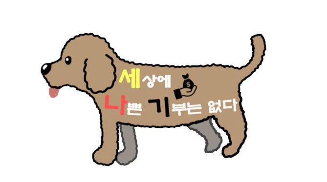
    <h2>세상에 나쁜 기부는 없다</h2>
    
블록체인 에스크로 서비스를 활용한 기부 플랫폼

    

<h3><a href="https://spring-astrodon-387.notion.site/P2P-a16a77fef9c34d7b983e8fe569365a8b">팀 노션</a>　|　
<a href="https://www.figma.com/file/N9qlwrJ4jB4s5CBNLUjwX3/%EC%84%B8%EB%82%98%EA%B8%B0"> FIGMA </a>　|　
<a href="https://docs.google.com/spreadsheets/d/14jT-Af2OJMfkrReO5qDPt3S-FcqphmEPx6oy-zsFPaU/edit"> 백 로그</a>　|　
<a href="https://www.erdcloud.com/d/zn43wETn4QF8tuaAW"> ERD </a>　|　
<a href="https://spring-astrodon-387.notion.site/1925dcb50e26444a9c9dbb2e5f73d762"> 지식 공유 </a>　

---
## :pushpin: 기술 스택

<table>
    <tr>
        <td><b>Back-end</b></td>
        <td>

 

 

</td>
    </tr>
    <tr>
    <td><b>Front-end</b></td>
    <td>

    </td>
    </tr>
    <tr>
    <td><b>Infra</b></td>
    <td>

</td>
    </tr>
    <td><b>Block-chain </b></td>
    <td>
    
    
    </td>
    </tr>
    <tr>
    <td><b>Tools</b></td>
    <td>
    
    

    </td>
    </tr>
</table>

---

## :pushpin: 프로젝트 소개

 **1. 서비스 설명**

  ### **개요**

   한줄 소개 : 블록체인 기술을 이용한 보호동물 기부 플랫폼
   서비스 명 : **세상에 나쁜 기부는 없다(세나기)**

  ### **타겟 🎯**

   유기동물을 위한 기부 서비스를 찾는 사람들
   기존 기부 서비스에 대한 불신을 가지고 있는 사람들
  
  👉 **유기동물을 위해 투명한 기부를 하고 싶은 사람들**

  

  

  ## **2. 기획 배경**

  ### **배경**

  사람들을 기부하지 않는 이유 1위는 , 후원 단체를 신뢰할 수 없어서라고 합니다.이러한 불신의 문제는 기부문화를 자체를 얼어붙게 만들어, 간절한 도움이 필요한 단체나 동물들이 적절한 후원을 받지 못하게 됩니다.

  `세나기`는 이러한 개인과 단체의 신뢰 문제를 블록체인을 활용한 스마트컨트렉트 서비스와 OCR을 활용하여 이러한 문제점들을 해결하고자 하였습니다.

  ### **목적 🥅**

  **신뢰성 있는 기부 플랫폼을 만들자**
  
  ### **의의**
  
   불신으로 가득한 기부문화 개선
   다양한 단체의 기부 캠페인을 한번에 볼 수 있는 플랫폼 역할
  
  

  

  ## **3. 서비스 메인화면**

  

  ## **4. 시연 영상**
  
  👇 시연 영상 youtube 👇
  
  https://www.youtube.com/watch?v=3itie8Ch4S0
  
  

---

## :pushpin: 활용 기술

---

## 1. BlockChain

### BlockChain이란?

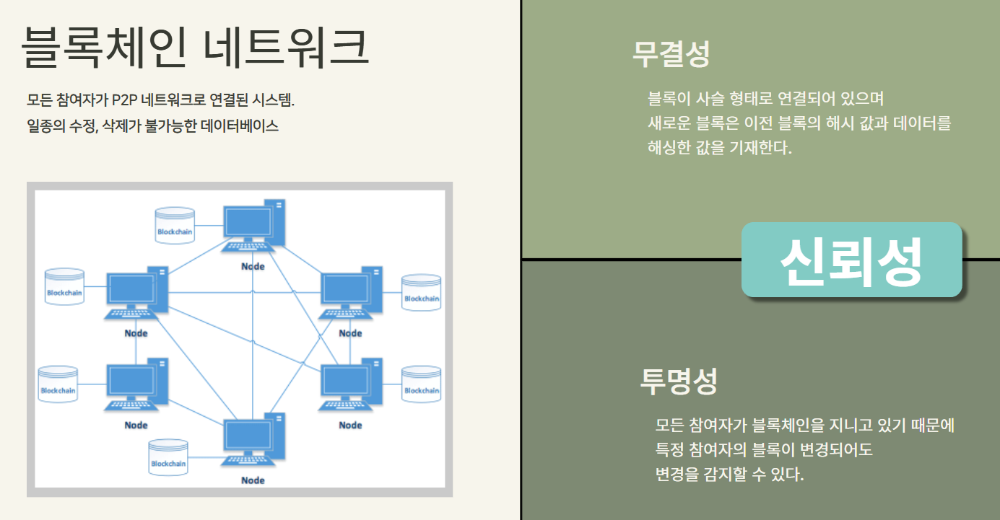

## 2. OCR

### OCR이란?

‘OCR’이란 ‘Optimal Character Recognition’의 줄임말로, 광학 문자 인식 기술이라고도 불립니다. 사람이 직접 쓰거나 이미지 속에 있는 문자를 이미지 스캔으로 얻은 다음, 이를 컴퓨터가 인식할 수 있도록 문자를 디지털화 하는 기술입니다. 

### [CLOVA OCR](https://clova.line.me/ocr_demo/en) 

> CLOVA OCR은 네이버에서 제공하는 서비스로 학계에서도 검증된 세계 최고 수준의 모델을 제공하며, 수요가 높은 다양한 형태의 문서들의 정보를 추출 할 수 있습니다.

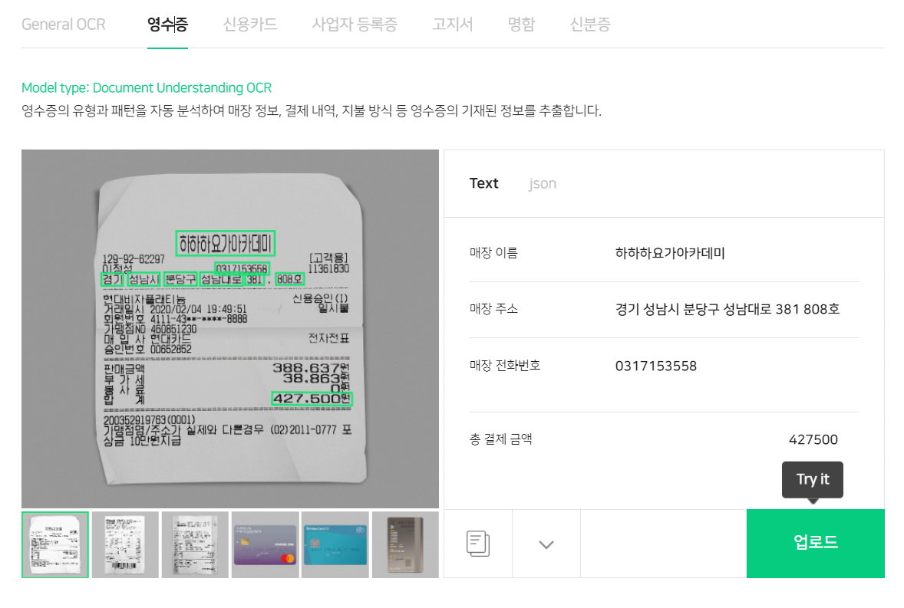

### **[CLOVA OCR](https://clova.line.me/ocr_demo/en)**

> CLOVA OCR은 네이버에서 제공하는 서비스로 학계에서도 검증된 세계 최고 수준의 모델을 제공하며, 수요가 높은 다양한 형태의 문서들의 정보를 추출 할 수 있습니다.

`세나기` 에서는 CLOVA OCR을 사용하여 기부금 출금에 사용합니다. 자세한 내용은 하단의 서비스 기능 소개에서 설명합니다.

## 🏗️**프로젝트 구성**

------

## **1. 서비스 아키텍쳐**

## 

## 2. 기부 프로세스

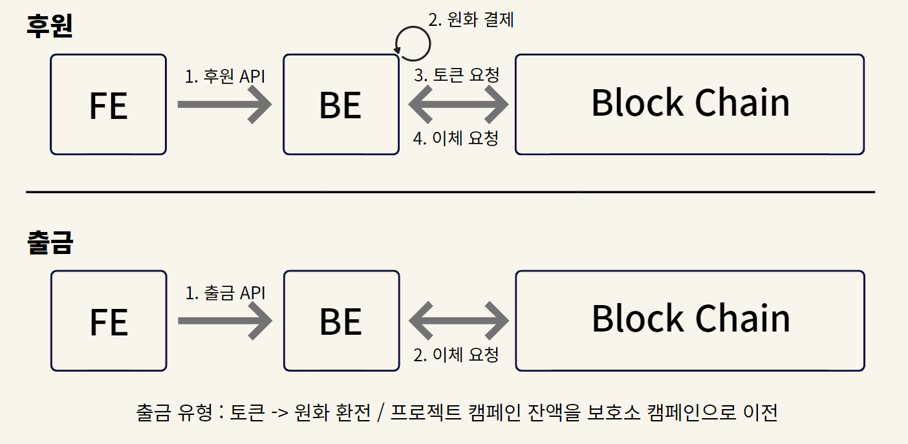

## 🔎**서비스 기능 소개**

------

### 회원가입

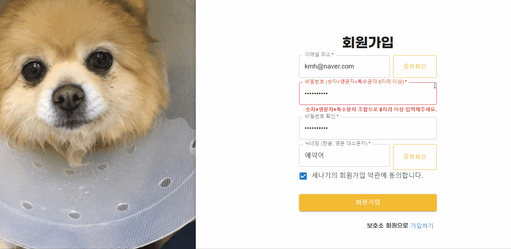

 아이디 , 닉네임 중복 확인
 회원가입시 자동 지갑 생성

## 기부 하기

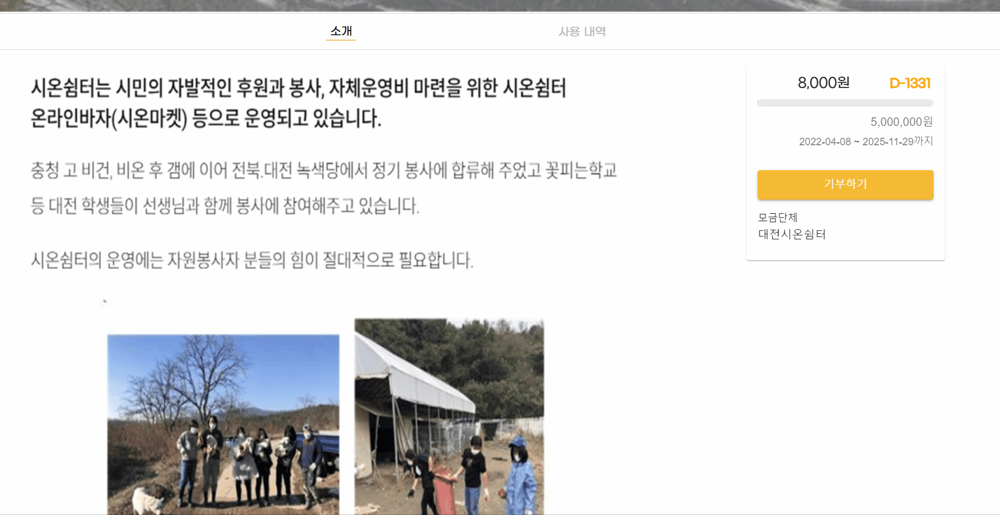

### 기부 내역 확인(마이페이지-후원자 로그인)

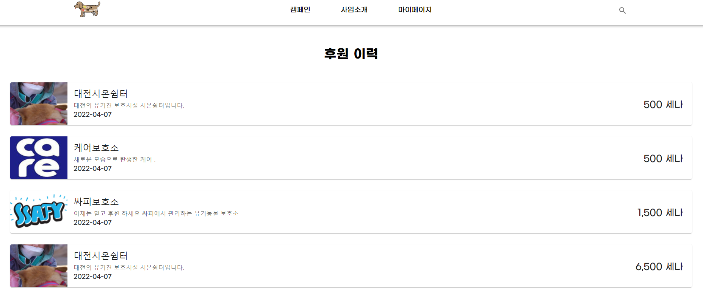

### 나의 캠페인 리스트 (마이페이지 - 보호소)

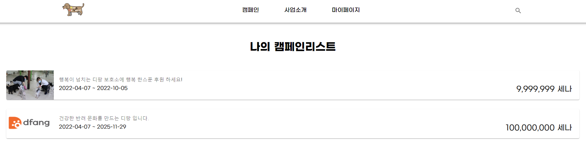

### 출금하기(OCR)

 영수증 이미지를 첨부하여 영수증 값 추출
 추출된 금액만큼 캠페인에서 출금 가능

### 총 출금 내역

 출금된 영수증 내역 조회

### 검색 결과

### 조건별 정렬

 마감임박순 , 최신순 , 조회순으로 정렬 가능
 종료 여부 정렬 가능

## 👨‍💻 **프로젝트 진행**

------

## **1. GitLab**

`우아한 형제들` 기술블로그에서 [git flow](https://techblog.woowahan.com/2553/) 참고하여 Git 컨벤션 및 Git flow 를 정하여 작업하였습니다.

`dev branch`, `work branch` , `feat branch`  , `release brach` 등 기능별, 용도별로 브랜치를 분기하여 사용하였습니다.

개발에 사용한 자세한 Git 컨벤션 및 GitFlow [링크](https://www.notion.so/Git-lab-convention-cd1dfddaba964b6da0795f2932acb56b)에 적어 놓았습니다

## 2**. Jira**

한 주를 시작하는 월요일에 이번주에 진행되어야할 이슈들을 백로그에 등록 했습니다. 지난주에 완료하지 못한 이슈와 앞으로 진행할 이슈를 추가하였습니다.

 에픽은 페이지 단위로 구성하였습니다.
 실시간으로 작업내용을 반영하여 팀원들이 작업 진행 상황을 서로 공유 할 수 있도록 하였습니다

## 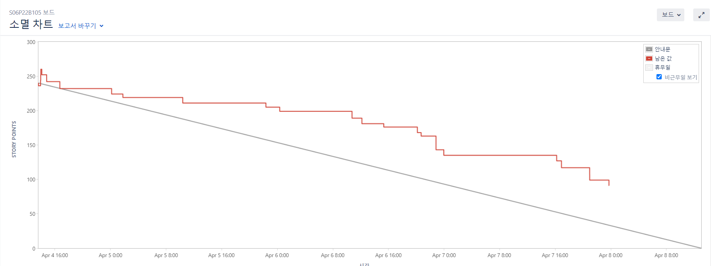

## 3**. Notion**

데일리 스크럼을 진행하면서 하루동안의 예상되는 이슈사항을 체크 했습니다.

회의록 작성을 통해 회의 내용을 문서화 해놓았습니다.

GitLab, Jira, DB의 컨벤션 규칙을 문서화 시켜 놓았습니다

전체 일정 관리를 점검하며 프로젝트를 점검하였습니다.

팀원 모두가 공유해얗는 자료 및 링크는 노션에 정리 하여 쉽게 찾아 볼 수 있도록 하였습니다

### 4. 요구사항 정의서 ****

 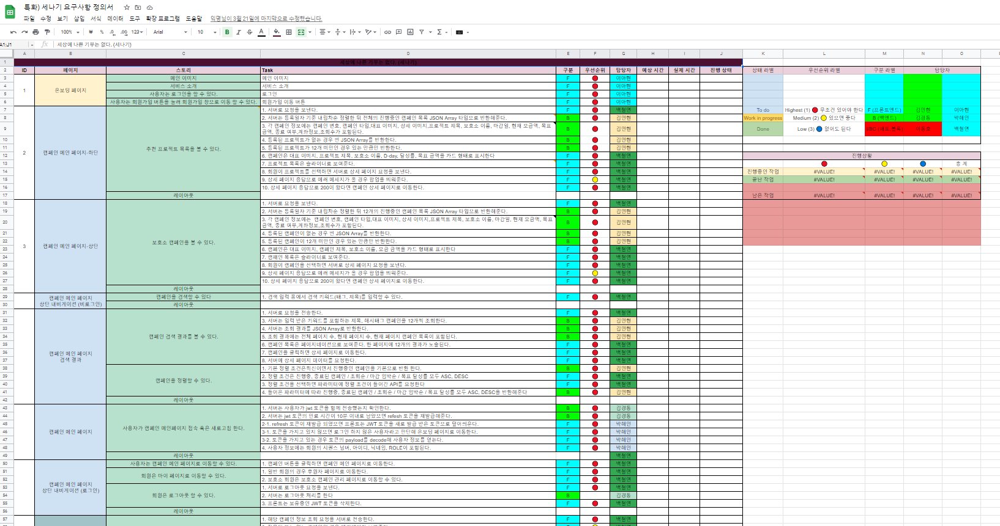`Google SpreadSheet` 를 활용하여 요구사항 정의서를 페이지-스토리-task로 나누어 정의하였습니다
 담당자와 우선순위를 정해 작업을 진행 하였습니다.

### UI/UX

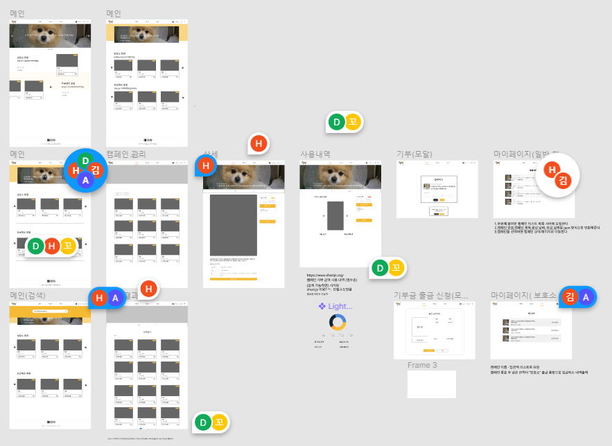

`Figma` 를 사용하여 페이지 단위로 상세 UI/UX를 작성했습니다.

### ERD

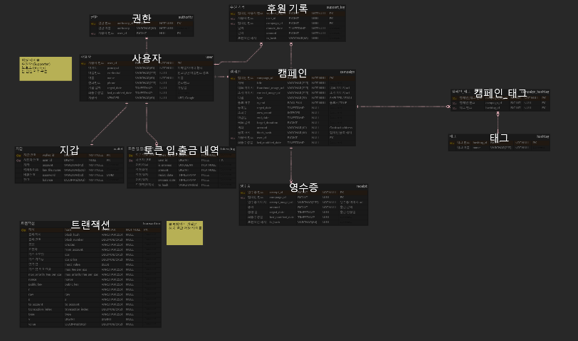

`erdCloud` 를 사용하여 erd 설계를 하였습니다.

## API

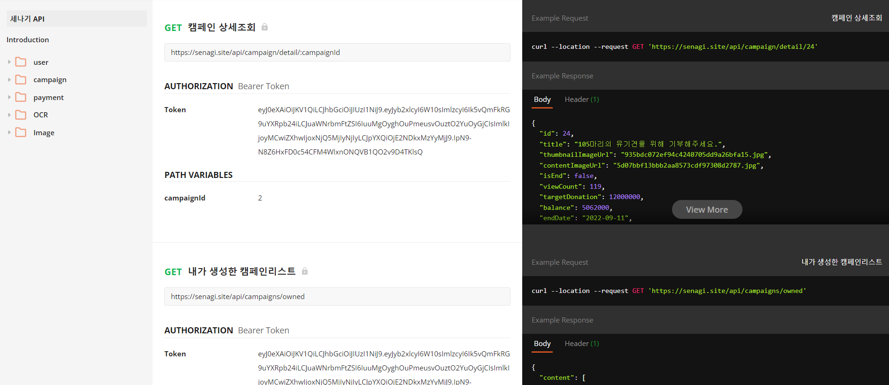`Postman` 을 활용하여 API 문서를 작성하였습니다.

